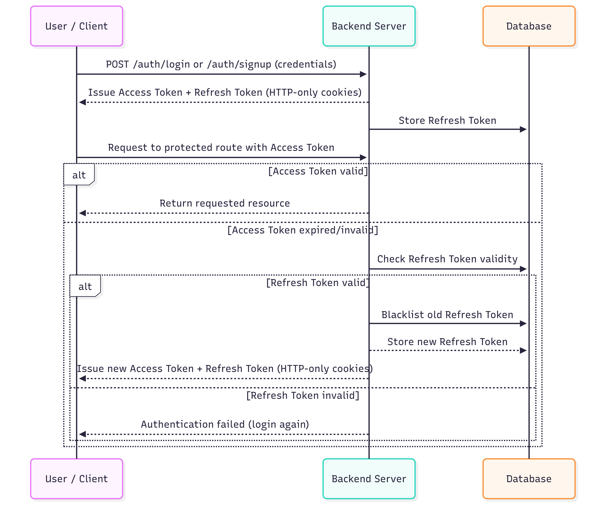

## Flow

# Authentication & Token Flow

1. **Login/Register**
   - User authenticates with credentials.
   - Server issues `Access Token` + `Refresh Token`.
   - Both tokens are set in **HTTP-only cookies**.

2. **Accessing Protected Routes**
   - Client sends request to `protected routes` with `Access Token`.
   - Auth Middleware will intercept the client request and checks jwt token is valid → request succeeds.
     .
   - if not valid then:
     - Auth Middleware will generate new `Access Token` and `Referesh Token`.
     - Old Refresh Token is **blacklisted** and store blacklisted token inside db.
     - New `Access Token` + `Refresh Token` are issued.
     - Store new Refresh Token in DB as refreshToken.
     - Send New `Access Token` + `Refresh Token` as cookies.

---

## Flow Diagram

