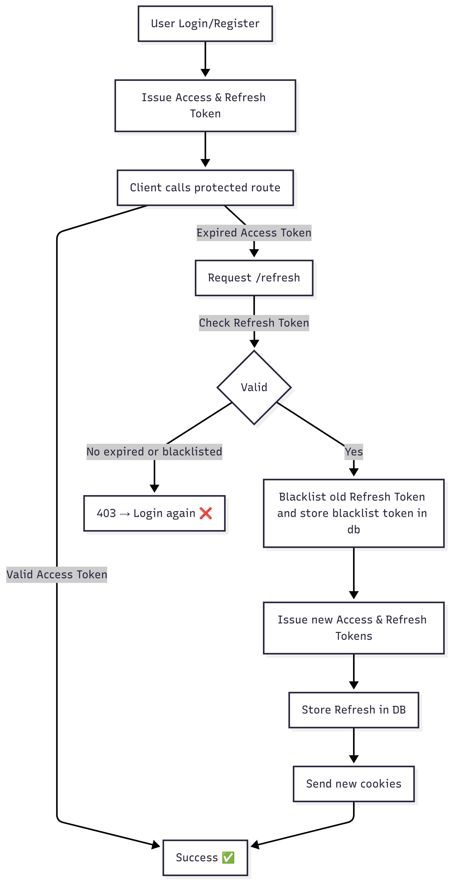

## Flow

# Authentication & Token Flow

1. **Login/Register**
   - User authenticates with credentials.
   - Server issues `Access Token` + `Refresh Token`.
   - Both tokens are set in **HTTP-only cookies**.

2. **Accessing Protected Routes**
   - Client sends request with `Access Token`.
   - If token is valid → request succeeds.
   - If expired → client calls `/refresh`.

3. **Token Refresh**
   - Client sends `Refresh Token` to `/refresh`.
   - Server checks:
     - Is token expired? → Return `403` → Login required.
     - Is token blacklisted? → Return `403`.
   - If valid:
     - Old Refresh Token is **blacklisted**.
     - Store blacklisted token inside db.
     - New `Access Token` + `Refresh Token` are issued.
     - Store new Refresh Token in DB.
     - Send tokens as cookies.

4. **Logout**
   - On logout, current Refresh Token is blacklisted.
   - Tokens removed from cookies.

---

## Flow Diagram

