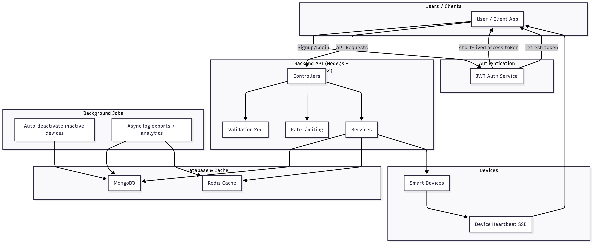

## Architecture

The Smart Device Management Platform backend is built with Node.js and Express, using MongoDB for data storage. Users, devices, and logs have incremental IDs (userId, deviceId, logId), with devices linked to their owners and logs linked to devices. The backend follows a clean architecture with separate controllers, services, and models, while Zod is used for strict input validation on all endpoints. JWT-based authentication secures API access, with short-lived access tokens, long-lived refresh tokens, and a blacklist mechanism for revoked tokens.

Device management supports real-time updates via Server-Sent Events (SSE), broadcasting heartbeat and status changes to connected clients. Redis caching improves performance for device listings and analytics queries and each endpoint have different-different chach time, with cache invalidation on updates. Background jobs automatically deactivate inactive devices, and endpoints have custom rate limits to prevent abuse. Asynchronous export and log aggregation enable efficient handling of large datasets. Overall, this architecture provides a secure, high-performance, and maintainable backend for managing smart devices and delivering real-time updates.
